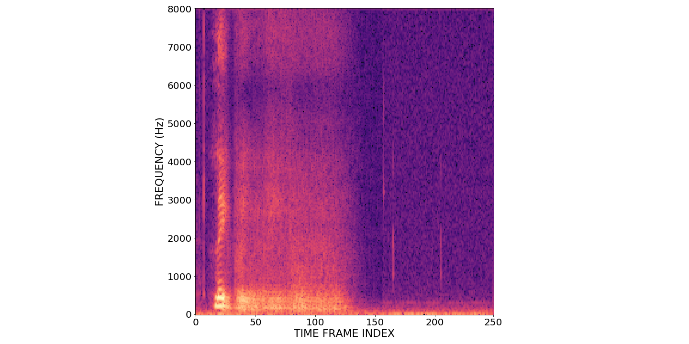

## Abstract
In this paper, we present a deep-learning-based framework for audio-visual speech inpainting, i.e. the task of restoring the missing parts of an acoustic speech signal from reliable audio context and uncorrupted visual information. Recent work focuses solely on audio-only methods and they generally aim at inpainting music signals, which show highly different structure than speech.
Instead, we inpaint speech signals with gaps ranging from 100 ms to 1600 ms to investigate the contribution that vision can provide for gaps of different duration.
We also experiment with a multi-task training approach where a phone recognition task is learned together with speech inpainting.
Results show that the performance of audio-only speech inpainting approaches degrade rapidly when gaps get large, while the proposed audio-visual approach is able to plausibly restore missing information. In addition, we show that multi-task learning is effective, although the largest contribution to performance comes from vision.

<div align="center">
<iframe
width="800" height="450" src="https://www.youtube.com/embed/_3rSsVrV2Dc" frameborder="0" allow="accelerometer; autoplay; encrypted-media; gyroscope; picture-in-picture" allowfullscreen>
</iframe>
</div>

## Demo
The following videos contains several examples of inpainted speech generated by models proposed in our paper.

### 800 ms Gap

#### Example 1
<div align="center">
<table>
  <tr>
	<th>
		Input
	</th>
	<td>
		
	</td>
	<td>
		<audio controls style="display:block;margin:auto; text-align: center">
			<source src="files/800ms/ex1/masked.wav" type="audio/wav">
		</audio>
	</td>
  </tr>
  <tr>
	<th>
		Audio-only MTL
	</th>
	<td>
		
	</td>
	<td>
		<audio controls style="display:block;margin:auto; text-align: center">
			<source src="files/800ms/ex1/ao_mtl.wav" type="audio/wav">
		</audio>
	</td>
  </tr>
  <tr>
	<th>
		Audio-Visual MTL
	</th>
	<td>
		
	</td>
	<td>
		<audio controls style="display:block;margin:auto; text-align: center">
			<source src="files/800ms/ex1/av_mtl.wav" type="audio/wav">
		</audio>
	</td>
  </tr>
  <tr>
	<th>
		Ground Truth
	</th>
	<td>
		
	</td>
	<td>
		<audio controls style="display:block;margin:auto; text-align: center">
			<source src="files/800ms/ex1/target.wav" type="audio/wav">
		</audio>
	</td>
  </tr>
</table>
</div>

#### Example 2
<div align="center">
<table>
  <tr>
	<th>
		Input
	</th>
	<td>
		
	</td>
	<td>
		<audio controls style="display:block;margin:auto; text-align: center">
			<source src="files/800ms/ex2/masked.wav" type="audio/wav">
		</audio>
	</td>
  </tr>
  <tr>
	<th>
		Audio-only MTL
	</th>
	<td>
		
	</td>
	<td>
		<audio controls style="display:block;margin:auto; text-align: center">
			<source src="files/800ms/ex2/ao_mtl.wav" type="audio/wav">
		</audio>
	</td>
  </tr>
  <tr>
	<th>
		Audio-Visual MTL
	</th>
	<td>
		
	</td>
	<td>
		<audio controls style="display:block;margin:auto; text-align: center">
			<source src="files/800ms/ex2/av_mtl.wav" type="audio/wav">
		</audio>
	</td>
  </tr>
  <tr>
	<th>
		Ground Truth
	</th>
	<td>
		
	</td>
	<td>
		<audio controls style="display:block;margin:auto; text-align: center">
			<source src="files/800ms/ex2/target.wav" type="audio/wav">
		</audio>
	</td>
  </tr>
</table>
</div>

### 1600 ms Gap

#### Example 1
<div align="center">
<table>
  <tr>
	<th>
		Input
	</th>
	<td>
		
	</td>
	<td>
		<audio controls style="display:block;margin:auto; text-align: center">
			<source src="files/1600ms/ex1/masked.wav" type="audio/wav">
		</audio>
	</td>
  </tr>
  <tr>
	<th>
		Audio-only MTL
	</th>
	<td>
		
	</td>
	<td>
		<audio controls style="display:block;margin:auto; text-align: center">
			<source src="files/1600ms/ex1/ao_mtl.wav" type="audio/wav">
		</audio>
	</td>
  </tr>
  <tr>
	<th>
		Audio-Visual MTL
	</th>
	<td>
		
	</td>
	<td>
		<audio controls style="display:block;margin:auto; text-align: center">
			<source src="files/1600ms/ex1/av_mtl.wav" type="audio/wav">
		</audio>
	</td>
  </tr>
  <tr>
	<th>
		Ground Truth
	</th>
	<td>
		
	</td>
	<td>
		<audio controls style="display:block;margin:auto; text-align: center">
			<source src="files/1600ms/ex1/target.wav" type="audio/wav">
		</audio>
	</td>
  </tr>
</table>
</div>

#### Example 2
<div align="center">
<table>
  <tr>
	<th>
		Input
	</th>
	<td>
		
	</td>
	<td>
		<audio controls style="display:block;margin:auto; text-align: center">
			<source src="files/1600ms/ex2/masked.wav" type="audio/wav">
		</audio>
	</td>
  </tr>
  <tr>
	<th>
		Audio-only MTL
	</th>
	<td>
		
	</td>
	<td>
		<audio controls style="display:block;margin:auto; text-align: center">
			<source src="files/1600ms/ex2/ao_mtl.wav" type="audio/wav">
		</audio>
	</td>
  </tr>
  <tr>
	<th>
		Audio-Visual MTL
	</th>
	<td>
		
	</td>
	<td>
		<audio controls style="display:block;margin:auto; text-align: center">
			<source src="files/1600ms/ex2/av_mtl.wav" type="audio/wav">
		</audio>
	</td>
  </tr>
  <tr>
	<th>
		Ground Truth
	</th>
	<td>
		
	</td>
	<td>
		<audio controls style="display:block;margin:auto; text-align: center">
			<source src="files/1600ms/ex2/target.wav" type="audio/wav">
		</audio>
	</td>
  </tr>
</table>
</div>

<!--
## Paper
The paper is available [here](https://arxiv.org/abs/1811.02480). If this project is useful for your research, please cite:
```
@article{morrone2018face,
  title={Face Landmark-based Speaker-Independent Audio-Visual Speech Enhancement in Multi-Talker Environments},
  author={Morrone, Giovanni and Pasa, Luca and Tikhanoff, Vadim and Bergamaschi, Sonia and Fadiga, Luciano and Badino, Leonardo},
  journal={arXiv preprint arXiv:1811.02480},
  year={2018}
}
```
-->